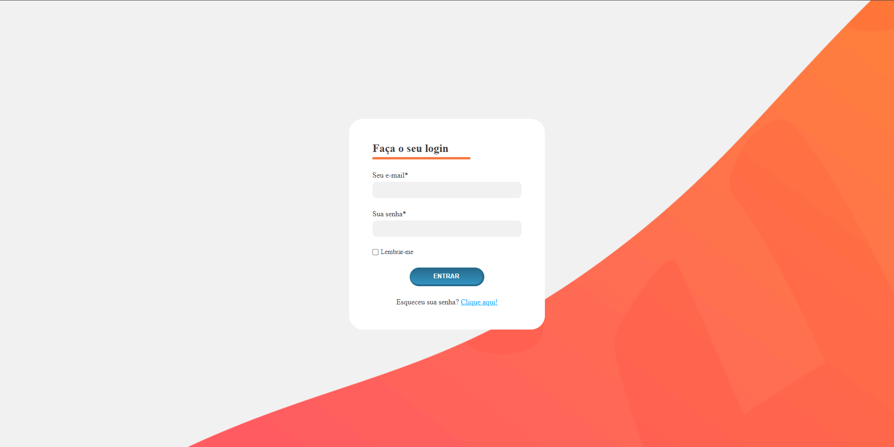

# Descrição da Tela de Login 🗒️
Crie uma tela de login com os requisitos mencionados, você pode seguir estas etapas:

Campo de Email: Utilize a tag ***input*** com o atributo type="email" para o endereço de email. 
Campo de Senha: Use a tag ***input*** com type="password" para a senha.
Checkbox "Lembrar-me": Adicione uma tag ***input*** com type="checkbox". 
Botão "Entrar": Insira uma tag ***button*** para o botão de login. 
Link "Esqueceu sua senha? Clique aqui!": Use a tag ***a*** para o link de recuperação de senha. 

Lembre-se de aplicar estilos CSS para uma interface amigável e responsiva, e utilize JavaScript para funcionalidades adicionais, como validação de campos. Isso garantirá uma experiência de usuário intuitiva e segura.

Prototipo.

